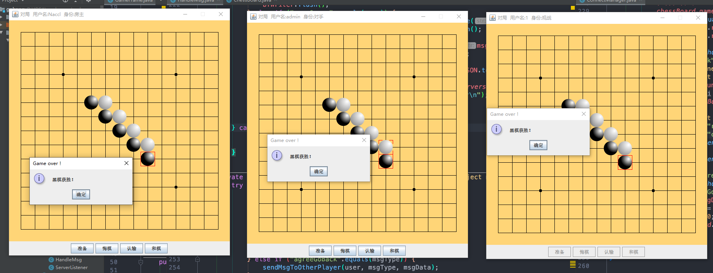
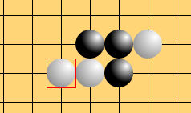
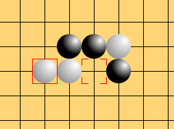
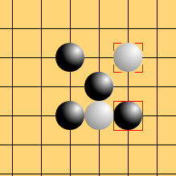

# 网络对战五子棋

## 运行截图

## Features

基于 Socket 的服务端，原生 Swing 客户端

数据库仅用于登录验证，没有实际功能

运行时需要先启动服务端，再启动客户端，可以有多个客户端，服务端会为每一个客户端分配一个线程，虽然耗费资源，但没有优化的必要

只能创建一个房间，可以有两个玩家，多个观战者

信任客户端的模式，大部分数据处理判断在客户端，服务端基本只负责数据传输

## 已发现的 BUG

经部署到 VPS 测试，出现以下 bug：

- 在两个客户端同一时刻出现此情况

  

  

  **原因：**

  因服务端只负责消息转发，并不参与处理棋盘信息，所以服务端多线程处理消息外加网络延迟可能导致棋子不同步

- **某一方棋子较多**

  

  **原因：**

  客户端进行悔棋和棋等需要对方同意的操作时，并没有禁止落子，导致服务端消息顺序为：请求悔棋（和棋） -- 落子 -- 同意（不同意）请求，而同意请求只对当前时刻状态生效

- 存在客户端连接的情况下，关闭服务端会导致客户端卡顿

  **原因：**

  因为未对客户端字节流的中断进行处理，断开时应先关闭客户端，再关闭服务端（在 catch 中处理字节流）

玩具项目没有修改计划...

## 用到的设计模式

**MVC**

**观察者模式**：每个用户（房主、对手、观战者）都是观察者，每个客户端创建一个线程监听服务端传来的消息，并在界面上响应

**单例模式**：登录用户类（一个客户端只能登录一个用户账号）、服务端房间管理类（只能创建一个房间，来不及做了）

**工厂模式、装饰者模式**：根据用户的需要创建不同样式的棋子（3D 样式或 2D 样式）

强行使用设计模式可能并不标准......

